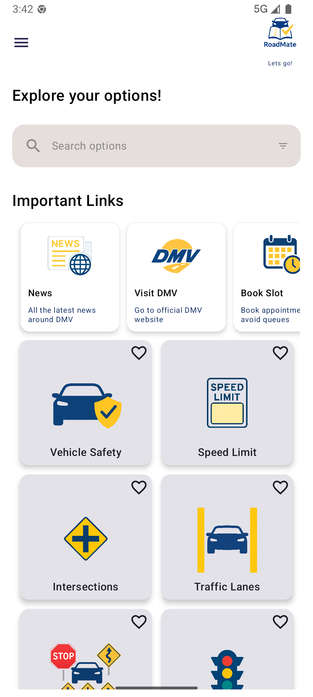
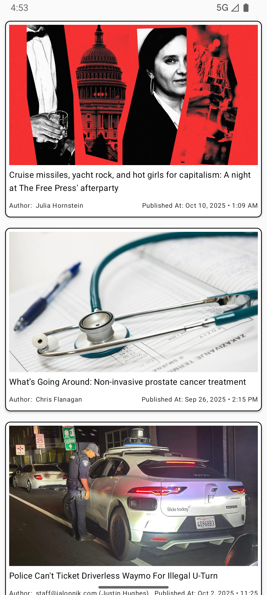

# RoadMate 🚗📱


---

## 📖 Overview
**RoadMate** is an Android app in progress that helps users **prepare for driving written tests** by providing learning material on driving rules and direct links to official DMV resources.

Currently, the app also includes a **News section** that fetches the latest DMV-related news articles to keep users updated.

---

## ✨ Features
- 📰 **News Articles**: Fetches and displays DMV-related news with images, descriptions, and "Read more" links.
- ⏱️ **Splash Screen**: Intro screen before navigating to the app’s home.
- 🧭 **Home Screen**: Navigation to different sections such as news, DMV links, and learning modules.
- 🔗 **Direct DMV Resources**: Quick links to DMV websites and study materials.
- 💡 **Modern Android Patterns**:
    - **MVVM architecture**
    - **Dependency Injection with Hilt**
    - **Coroutines & Flows** for async operations
    - **Retrofit + OkHttp** for API requests
    - **Jetpack Compose** for UI
    - **StateFlow + ViewModel** for reactive UI
    - **Navigation Component** with safe state passing

---

## 🛠️ Tech Stack
- **Language**: Kotlin
- **UI**: Jetpack Compose, Material 3
- **Architecture**: MVVM (Model-View-ViewModel)
- **Networking**: Retrofit, OkHttp, Moshi/Gson
- **Image Loading**: Glide (Landscapist)
- **DI**: Hilt
- **Asynchronous**: Kotlin Coroutines + Flows
- **Navigation**: Jetpack Navigation Compose


---

## 📂 Current Progress
- ✅ Basic project setup with Hilt, Coroutines, and MVVM.
- ✅ Implemented News module (fetch + display articles).
- ✅ Article detail view with “Read more” redirection.
- ⏳ Upcoming:
    - Add quiz module for practice questions.
    - Add bookmarking & offline support.
    - Integrate official DMV appointment & links.

---

## 🚀 Getting Started
1. Clone the repository:
   ```bash
   git clone https://github.com/<your-username>/RoadMate.git
   ```
2. Open in **Android Studio** (latest stable).
3. Add your [NewsAPI](https://newsapi.org) key in the `NewsApi` configuration.
4. Build & run on an emulator or device (Android 8.0+).

---

## 📸 Screenshots
<p>
  
  
</p>

---

